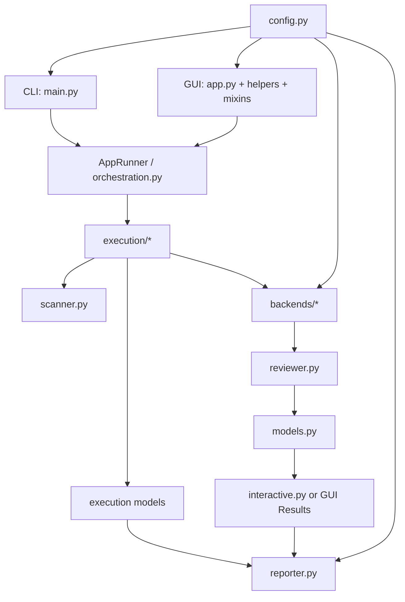
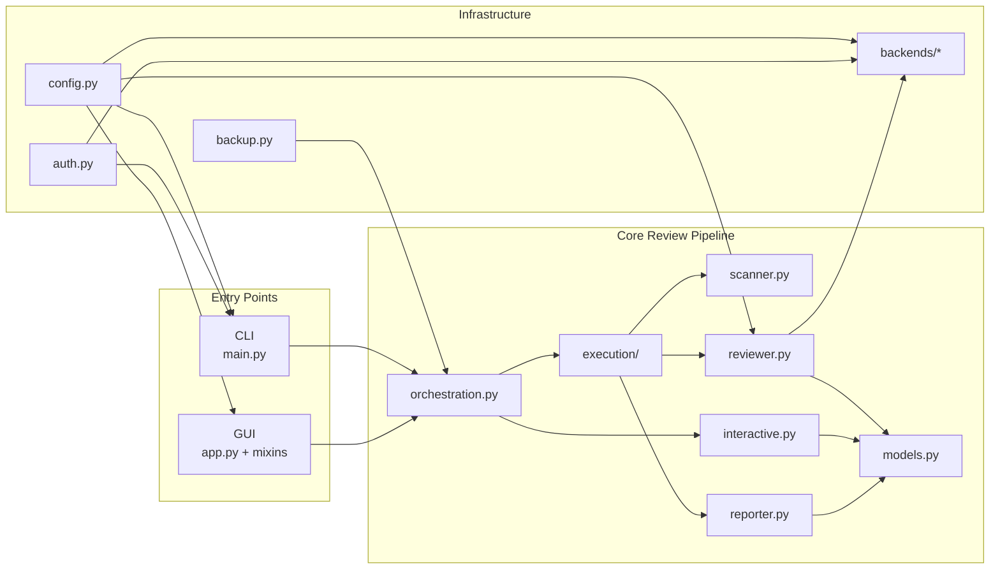
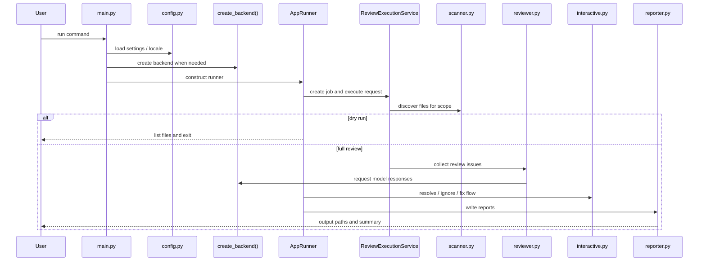
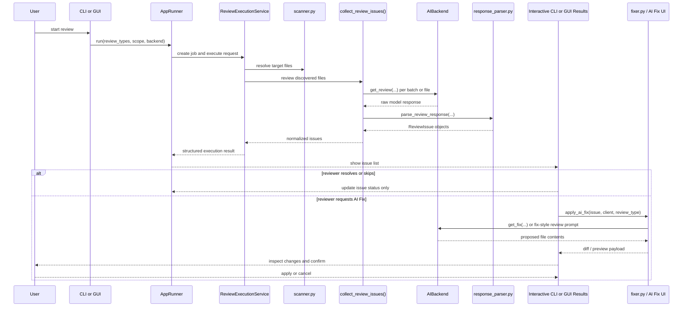
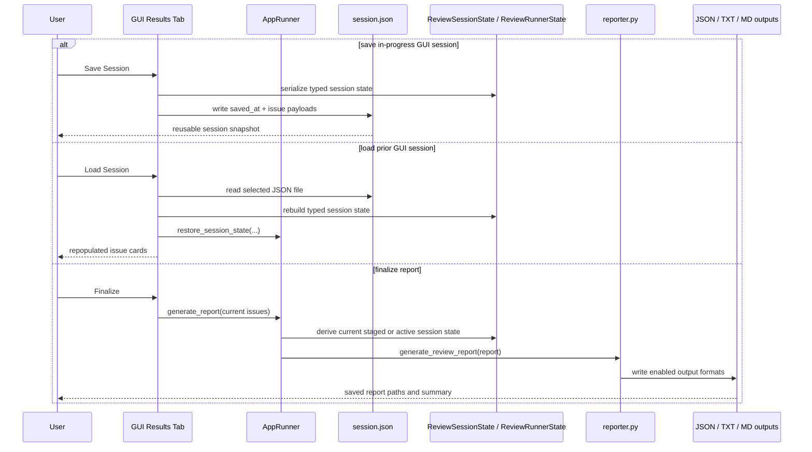

# Architecture

This page is a contributor-oriented overview of how the system is structured.

Forward-looking implementation specs live under `.github/specs/`. The current extensibility and queueing roadmap is tracked in `.github/specs/platform-extensibility/spec.md`.
The current GUI cleanup plan is tracked in `docs/handoffs/gui-architecture-plan-2026-04-05.md`.

## High-Level Flow

1. Input enters through the CLI or GUI.
2. `AppRunner` normalizes the request and delegates execution to the typed execution layer.
3. Files are discovered by the scanner.
4. The execution service routes work to the reviewer and backend.
5. Review findings are normalized into model objects and execution/session state.
6. Interactive or GUI workflows let users inspect, resolve, ignore, skip, or fix issues.
7. The reporter writes the final outputs.

## Flow Diagram

## Component Diagram

## CLI Sequence

## Reviewer Pipeline Sequence

## Report And Session Sequence

## Report Persistence Notes

- GUI session save/load stores issue state plus the deferred report metadata needed to finalize a reloaded session.
- The saved JSON payload remains backward-compatible, but the in-memory restore path now flows through `ReviewSessionState`, `DeferredReportState`, and `ReviewRunnerState`.
- Restoring a saved session rebuilds deferred execution state needed for GUI finalization, but it does not restore live backend clients or rerun scans.
- Final report generation uses the in-memory issue list currently shown in the GUI, so status changes, skips, and AI-fix outcomes are reflected in the exported report.
- Output file formats are controlled by the `output.formats` config value and may emit JSON, TXT, and Markdown in one finalize action.

## Main Components

| Area | Responsibility |
|---|---|
| `main.py` | CLI argument parsing and entry-point flow |
| `gui/` | Desktop UI, state, workflows, health checks, settings, and log output |
| `execution/` | Typed execution requests, jobs, results, deferred-report state, and saved-session state |
| `scanner.py` | File discovery and diff-scope handling |
| `orchestration.py` | Public orchestration facade bridging CLI and GUI callers onto the execution layer |
| `backends/` | Bedrock, Kiro, Copilot, and local LLM integrations |
| `reviewer.py` | Core review generation and advanced analysis behavior |
| `interactive.py` | Interactive CLI actions after findings are produced |
| `reporter.py` | Report generation in configured formats |
| `models.py` | Report and issue data structures |
| `config.py` | Config loading, defaults, and typed access |

## Backends

Backends share a common interface via `AIBackend` and are created through `create_backend()`.

Key design points:
- lazy imports keep startup lighter
- backends can stream partial output into the GUI status flow
- backend choice affects auth, timeouts, and transport details, not the higher-level review model

## GUI Structure

The GUI is composed around mixins:
- review tab behavior
- results and AI Fix behavior
- settings mapping and persistence
- backend health checks and model refreshes

This keeps the main application shell smaller while preserving a unified window and shared state. Session save/load and deferred report finalization are routed through the same typed execution/session models used by orchestration rather than through GUI-local state assembly.

The current GUI shell is split between page mixins and helper modules:
- mixins own page-specific behavior such as review setup, benchmark browsing, results workflows, settings persistence, and health/model-refresh actions
- helper modules own startup, shutdown, detached-window lifecycle, embedded local HTTP startup, runtime callback cleanup, and shared shell/status behavior

## GUI Internal Roles

| Module | Responsibility |
|---|---|
| `gui/app.py` | top-level window, tabs, log plumbing, common status UI |
| `gui/app_bootstrap.py` | startup initialization, shared runtime state, tab creation, and global shortcut binding |
| `gui/app_lifecycle.py` | post-build startup actions, detached-window restore, and clean shutdown |
| `gui/app_surfaces.py` | status bar, Output Log tab, shared toasts, and detached-window lifecycle helpers |
| `gui/app_local_http.py` | embedded local HTTP server startup and status wiring from GUI settings |
| `gui/review_mixin.py` | review setup, validation, execution start, dry-run flow |
| `gui/benchmark_mixin.py` | benchmark browser loading, comparison state, preview/diff actions, and detached benchmark behavior |
| `gui/results_mixin.py` | issue cards, filtering, AI fix mode, sessions, finalization |
| `gui/settings_mixin.py` | config editing and persistence |
| `gui/health_mixin.py` | backend health checks and model refresh behavior |
| `gui/review_execution_*` and `gui/review_queue_*` | scheduler-backed review submission, queue coordination, and queue presentation |
| `gui/widgets.py` | shared widgets, tooltips, log handler |

Recent GUI/runtime behaviors worth knowing:
- the Review page remains anchored in the main window, but Benchmarks, Settings, and Output Log can be detached into their own windows and redocked later
- detached-window restore and geometry persistence are part of the main shell lifecycle, not ad hoc page-local popups
- the embedded local HTTP API can start automatically from GUI settings and shares the same execution runtime as the desktop app

## Addon Extension Surfaces

The current addon system is intentionally narrow and manifest-driven. Addons are discovered from local paths, validated during runtime composition, and only activate supported entry-point families.

Supported manifest entry points:

| Entry Point | Purpose |
|---|---|
| `entry_points.review_packs` | contribute custom review-definition packs |
| `entry_points.backend_providers` | register in-process backend factories |
| `entry_points.ui_contributors` | add descriptive Settings-surface cards |
| `entry_points.editor_hooks` | observe popup editor and diff-preview state, return inline diagnostics, and react to patch application |

The editor hook surface is designed for the existing AICodeReviewer review flow rather than as a generic IDE plugin API. Hook payloads are plain Python dictionaries so addons can stay lightweight and do not need to import GUI internals.

Common payload fields:

| Field | Meaning |
|---|---|
| `event` | canonical event name dispatched to the hook |
| `trigger` | local trigger that caused the payload to be emitted |
| `surface` | review surface such as `editor` or `diff_preview` |
| `issue_index` | Results-tab issue index associated with the popup |
| `file_path` | reviewed file path |
| `display_name` | short filename shown in the popup title |
| `content` or `current_content` | active working text for the popup surface |
| `buffer_key` | active editor buffer key such as `working` or `reference` |
| `cursor_index` / `cursor_line` | active editor cursor position when applicable |
| `page_index` / `total_pages` | current large-file page state when paging is active |
| `change_index` / `change_count` | active diff-hunk navigation state for diff preview |
| `edited` | whether the staged preview differs from the original AI-generated fix |

Supported editor-hook event names:

| Event | When It Fires |
|---|---|
| `buffer_opened` | a popup editor loads its initial working buffer |
| `buffer_switched` | the reviewer switches between working and reference buffers |
| `buffer_saved` | the popup editor saves or stages the current working buffer |
| `buffer_closed` | the popup editor closes through its normal cancel or close path |
| `staged_preview_opened` | the AI-fix diff preview opens for a staged fix |
| `change_navigation` | the reviewer jumps to the next or previous diff change |
| `preview_staged` | the reviewer saves an edited staged preview back into the batch-apply flow |

Hook handlers can implement either targeted methods such as `on_buffer_saved(...)` and `on_preview_staged(...)`, or broader handlers such as `on_editor_event(...)` and `on_buffer_event(...)`. Diagnostics are returned through `collect_diagnostics(...)` or `get_diagnostics(...)` and are rendered inline in the popup editor or diff preview.

Reference examples:

- [examples/addon-echo-backend/addon.json](../examples/addon-echo-backend/addon.json)
- [examples/addon-editor-hooks/addon.json](../examples/addon-editor-hooks/addon.json)
- [examples/addon-editor-hooks/README.md](../examples/addon-editor-hooks/README.md)

## Documentation Rule

When product behavior changes, update:
- the relevant user-facing guide in `docs/`
- any impacted example or walkthrough
- contributor docs if the change affects development workflows

## Related Guides

- [Contributing](contributing.md)
- [Configuration Reference](configuration.md)
- [Release Process](release-process.md)