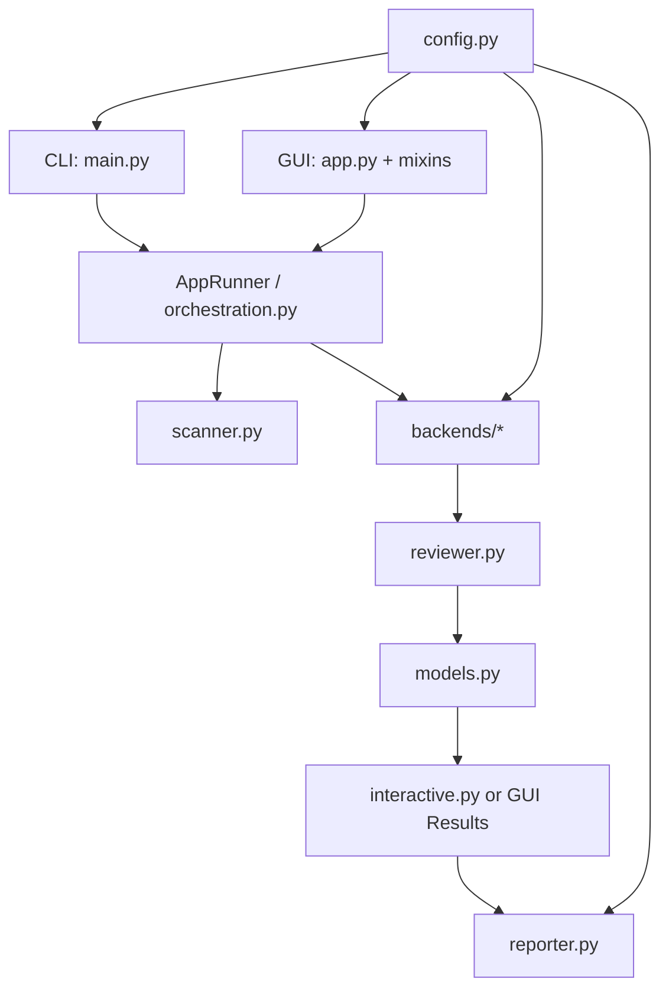

# Architecture

This page is a contributor-oriented overview of how the system is structured.

## High-Level Flow

1. Input enters through the CLI or GUI.
2. Files are discovered by the scanner.
3. The orchestrator batches and routes work to a backend.
4. Review findings are normalized into model objects.
5. Interactive or GUI workflows let users inspect, resolve, ignore, skip, or fix issues.
6. The reporter writes the final outputs.

## Flow Diagram

## Main Components

| Area | Responsibility |
|---|---|
| `main.py` | CLI argument parsing and entry-point flow |
| `gui/` | Desktop UI, state, workflows, health checks, settings, and log output |
| `scanner.py` | File discovery and diff-scope handling |
| `orchestration.py` | Review-session orchestration and backend coordination |
| `backends/` | Bedrock, Kiro, Copilot, and local LLM integrations |
| `reviewer.py` | Core review generation and advanced analysis behavior |
| `interactive.py` | Interactive CLI actions after findings are produced |
| `reporter.py` | Report generation in configured formats |
| `models.py` | Report and issue data structures |
| `config.py` | Config loading, defaults, and typed access |

## Backends

Backends share a common interface via `AIBackend` and are created through `create_backend()`.

Key design points:
- lazy imports keep startup lighter
- backends can stream partial output into the GUI status flow
- backend choice affects auth, timeouts, and transport details, not the higher-level review model

## GUI Structure

The GUI is composed around mixins:
- review tab behavior
- results and AI-fix behavior
- settings mapping and persistence
- backend health checks and model refreshes

This keeps the main application shell smaller while preserving a unified window and shared state.

## Documentation Rule

When product behavior changes, update:
- the relevant user-facing guide in `docs/`
- any impacted example or walkthrough
- contributor docs if the change affects development workflows

## Related Guides

- [Contributing](contributing.md)
- [Configuration Reference](configuration.md)
- [Release Process](release-process.md)