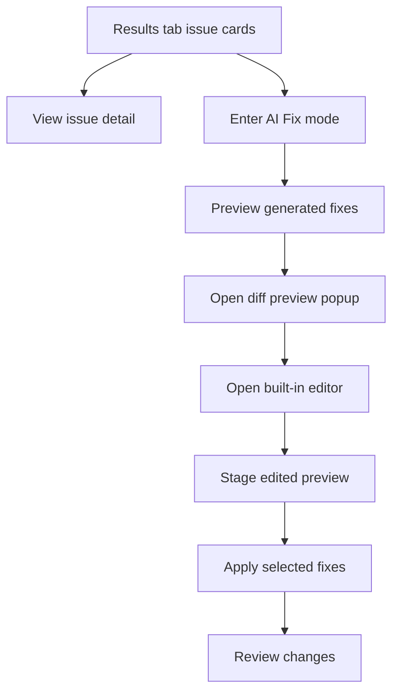
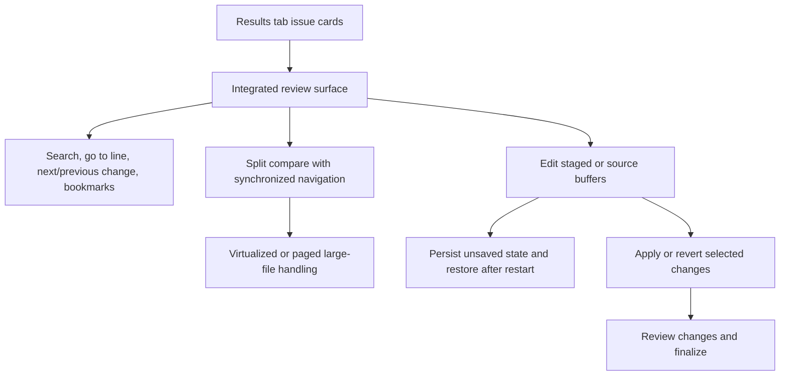

# GUI UX Audit And Improvement Backlog

This document starts Milestone 6 from the platform extensibility roadmap: a concrete UX audit with current-state findings, target-state flows, and a prioritized execution backlog for the desktop and CLI experience.

## Scope

- desktop Review, Results, and editor/viewer workflows
- AI Fix preview, diff review, and in-app editing affordances
- discoverability, navigation, feedback states, and keyboard flow
- remaining editor/viewer resilience gaps and follow-on large-file handling improvements

## Current-State Findings

### Strengths

- The Review tab now has clearer recommendation, preset, and pinning workflows, so users can reach a focused review set without building the matrix manually.
- The Results tab already has a strong triage surface: overview cards, quick filters, issue cards, AI Fix staging, session save/load, and report finalization.
- The built-in editor and diff preview are more than placeholders: they now support extension-aware syntax highlighting fallback, line numbers, undo/redo, inline find, side-by-side diff panes, preview staging, and user-edited AI fix flows.

### Friction Points

- Editor/viewer power features are present but not discoverable enough. Important actions were keyboard-driven or buried in popup flows rather than surfaced as explicit controls.
- Diff review lacked first-class next/previous change navigation, so long previews required manual scrolling.
- The built-in editor lacked explicit go-to-line affordances even though the workflow is line-oriented and issue cards already point users to reported lines.
- Large-file handling is now safer, with progressive loading, visible progress, truncation/read-only guardrails, and an initial paged read-only path in the built-in editor, but the popup surfaces still do not provide true virtualization for very large files.
- State recovery is better than the original baseline: popup editor drafts and staged AI-fix popup context can now be restored after restart, but broader multi-popup continuity remains limited.
- CLI flows remain operational and scriptable, but they still rely on users knowing the command surface rather than getting guided multi-step affordances.

## Current-State Flow

## Target-State Flow

## Priority Backlog

### P0

- Add explicit go-to-line and change-navigation affordances to the existing editor and diff preview.
- Document the current GUI UX gaps and execution plan so future slices are guided by concrete findings rather than ad hoc tweaks.
- Preserve keyboard access for the improved navigation features.

### P1

- Implemented: introduced a reusable editor/viewer controller instead of embedding large popup implementations directly inside Results-tab methods.
- Implemented: added buffer-size guardrails, progressive loading, and visible progress feedback for large files.
- Implemented: persisted popup editor state for unsaved buffers, active file, cursor position, and pending staged AI-fix edits.
- Implemented: expanded syntax-highlighting fallback behavior beyond the original Python-specialized path.

### P2

- Implemented: added lightweight bookmarks plus replace and next/previous search navigation in the built-in editor.
- Implemented: added lightweight section extraction, symbol navigation, and per-section folding in the built-in editor.
- Implemented: added context-menu access and stronger keyboard discoverability for search, replace, bookmarks, folding, and page navigation.
- Implemented: added minimal tabbed popup navigation so reviewers can switch between the working draft and a read-only issue snippet reference without opening a second editor window.
- Implemented: added per-tab state badges so the tab strip reflects dirty draft state plus buffer-local bookmark and fold counts.
- Implemented: added lightweight tab hover summaries and subdued state accents so dirty or marked buffers scan faster without expanding the badge text.
- Implemented: added tiny per-state glyph markers so dirty, bookmarked, and folded buffers read faster than border-only accents while keeping the tab label itself compact.
- Implemented: added keyboard-first buffer cycling and a compact active-buffer status summary so tab context remains available even when attention shifts away from the tab strip.
- Implemented: added direct numeric buffer jumps in the editor and symmetric keyboard-first pane switching in the diff preview so popup navigation scales past the current two-buffer layout.
- Implemented: added addon-facing editor hooks for buffer lifecycle, popup diagnostics, and patch-application events so addons can observe editor state and react when staged fixes are written.

## Initial Executed Slice

The first Milestone 6 implementation slice in this repository adds:

- explicit go-to-line controls in the built-in editor
- explicit previous/next change navigation in the diff preview
- keyboard-accessible shortcuts for those actions
- focused GUI workflow coverage for both navigation paths

The second Milestone 6 slice in this repository adds:

- a reusable popup editor/viewer controller shared by the built-in editor and diff preview
- progressive large-file loading with visible progress, truncation limits, and read-only guardrails
- popup recovery for unsaved editor drafts and staged AI-fix preview state
- restart-style GUI workflow coverage for popup recovery and large-file guardrails

This still does not close Milestone 6. It establishes the audit artifact, closes the first navigation gaps, and delivers the first resilience-focused refactor without yet adding true virtualization, multi-buffer navigation, or richer editor tooling.

The third Milestone 6 slice in this repository adds:

- extension-aware syntax-highlighting fallback for JSON, YAML, config-style files, and JavaScript/TypeScript-family files
- widget-level GUI workflow coverage that verifies non-Python popup editors still apply syntax tags and show the correct language label

The fourth Milestone 6 slice in this repository adds:

- replace plus explicit next/previous search navigation in the built-in editor
- lightweight bookmarks for line-oriented review workflows
- an initial paged read-only path for oversized files in the built-in editor so users can move past the first chunk without waiting for full virtualization
- focused GUI workflow coverage for replace/navigation, bookmarks, and paged large-file viewing

The fifth Milestone 6 slice in this repository adds:

- lightweight symbol or section extraction for popup-editor review sessions, with a section menu and per-section folding controls
- right-click context-menu affordances plus expanded shortcut hints so search, replace, bookmarks, folding, and paging remain discoverable as the toolbar grows
- paged large-file diff preview behavior so oversized compare sessions can move across pages instead of degrading to a single partial compare pane
- focused GUI workflow coverage for section/folding behavior and paged large-file diff preview flows

The sixth Milestone 6 slice in this repository adds:

- per-buffer tab-strip badges for dirty draft state and buffer-local bookmark or folded-section counts so reviewers can see which buffer needs attention before switching
- lightweight hover summaries and restrained accent styling on tab buttons so bookmark and fold state remain legible without overloading the label text
- focused GUI workflow coverage that verifies the tab strip updates as editor state changes in the working and reference buffers

The seventh Milestone 6 slice in this repository adds:

- tiny color-coded tab glyphs for dirty draft, bookmark, and folded-section state so reviewers can identify why a tab is accented before reading the hover summary
- a cleaner tab-label render that leaves the buffer name stable while the glyph strip carries the fast-scan state cues
- focused GUI workflow coverage that verifies both the glyph content and the active/inactive marker colors for working and reference buffers

The eighth Milestone 6 slice in this repository adds:

- keyboard-first tab switching with Ctrl+Tab and Ctrl+Shift+Tab so reviewers can cycle between working and reference buffers without reaching for the mouse
- a compact active-buffer summary in the status bar that surfaces the current buffer label plus dirty, read-only, bookmark, fold, and page state when relevant
- focused GUI workflow coverage that verifies both keyboard tab cycling and status-summary updates across working and reference buffers

The ninth Milestone 6 slice in this repository adds:

- direct numeric editor-buffer jumps with Ctrl+1 through Ctrl+9 so the tab model can scale without relying only on sequential cycling
- symmetric diff-preview pane navigation with Ctrl+Tab, Ctrl+Shift+Tab, and Ctrl+1 through Ctrl+3 across original, fixed, and optional user-edited panes
- focused GUI workflow coverage that verifies direct editor buffer jumps and keyboard diff-preview pane switching

The tenth Milestone 6 slice in this repository adds:

- per-pane diff-preview status text so keyboard-focused reviewers can keep active compare context visible without depending on header color alone
- batch AI-fix popup issue navigation with Ctrl+Tab, Ctrl+Shift+Tab, and Ctrl+1 through Ctrl+9 so the popup stack now exposes the same direct-jump model one level above the diff preview
- focused GUI workflow coverage that verifies both diff-preview pane summaries and batch-popup issue-jump state

## Validation Status

- Focused editor fallback validation after the third slice: 3 passed.
- Full GUI workflow suite status after the third slice: 82 passed.
- Focused editor workflow validation after the fourth slice: 4 passed.
- Focused editor and diff workflow validation after the fifth slice: 4 passed.
- Focused tab-strip workflow validation after the seventh slice: 4 passed.
- Full GUI workflow suite status after the seventh slice: 92 passed.
- Focused keyboard tab-cycle validation after the eighth slice: 5 passed.
- Full GUI workflow suite status after the eighth slice: 93 passed.
- Focused numeric-jump and diff-pane keyboard validation after the ninth slice: 7 passed.
- Full GUI workflow suite status after the ninth slice: 94 passed.
- Focused diff-status and batch-popup issue-jump validation after the tenth slice: 4 passed.