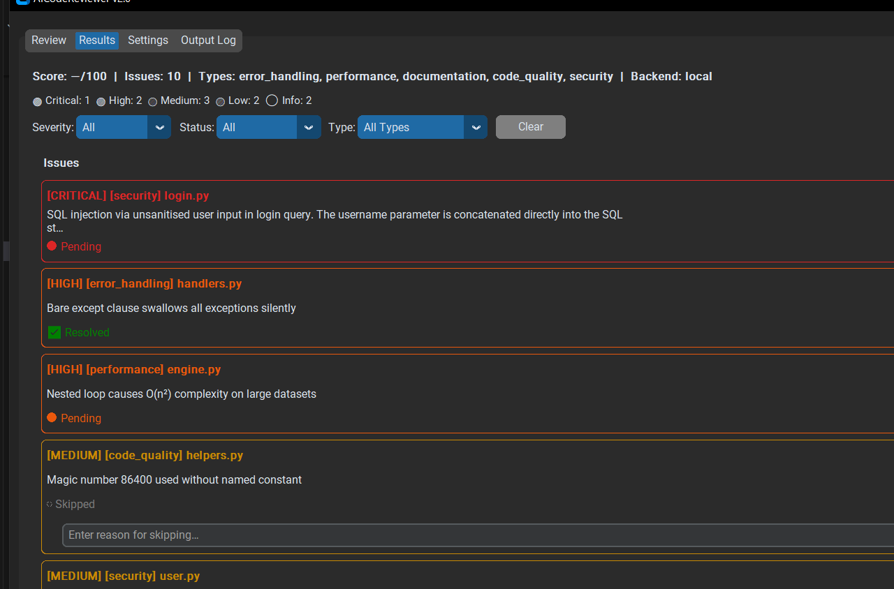
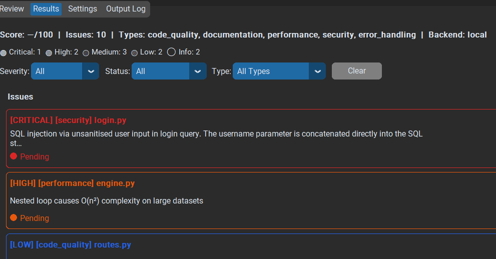
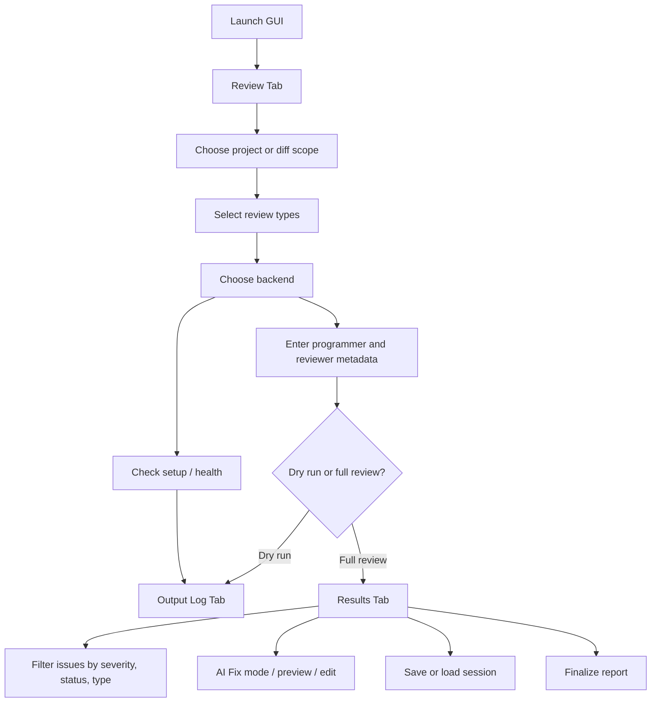
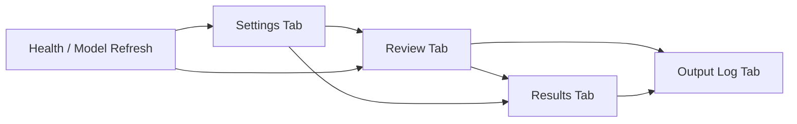

# GUI Guide

The GUI exposes the same core review system as the CLI through a four-tab desktop workflow.

## Launch

```bash
aicodereviewer --gui
```

The screenshots below are generated from the real test-mode GUI with:

```powershell
./tools/capture_gui_screenshots.ps1
```

## Screenshots

### Results Tab



### AI Fix Mode



## Tabs

### Review Tab

Use the Review tab to set up a run.

Capabilities:
- choose project or diff scope
- pick a project path
- choose all files or selected files
- apply diff-based filtering to a project review
- select one or more review types
- choose backend
- enter programmers and reviewers
- run a full review or dry run

Additional controls:
- progress bar
- cancel button
- elapsed timer
- backend health checks from the status area

### Results Tab

Use the Results tab to inspect and act on findings.

Capabilities:
- severity, status, and type filters
- issue cards with summaries and detail views
- AI Fix mode for single and batch workflows
- preview and edit proposed changes before applying them
- save and load review sessions
- review changes for resolved items
- finalize reports

### Settings Tab

Use the Settings tab to manage persistent configuration.

Capabilities:
- backend-specific settings
- performance and processing options
- logging settings
- GUI preferences
- output format selection
- model selection fields where supported

### Output Log Tab

Use the Output Log tab to inspect runtime messages.

Capabilities:
- live log stream
- severity filtering
- clear log
- save log to a text file

## Typical GUI Workflow

1. Open the Review tab.
2. Choose scope and project path.
3. Select review types.
4. Choose the backend.
5. Enter programmer and reviewer metadata.
6. Start the review.
7. Use the Results tab to inspect, filter, fix, save sessions, and finalize.
8. Use the Output Log tab if anything looks wrong or you need runtime detail.

## GUI Workflow Diagram



## GUI State Relationships



## Testing and Manual Validation

The repository includes a manual GUI harness:

```bash
python tools/manual_test_gui.py
```

This is useful for validating:
- results rendering
- log output
- settings behavior in testing mode
- AI fix and review-session UI flows

## Related Guides

- [Getting Started](getting-started.md)
- [Configuration Reference](configuration.md)
- [Troubleshooting](troubleshooting.md)