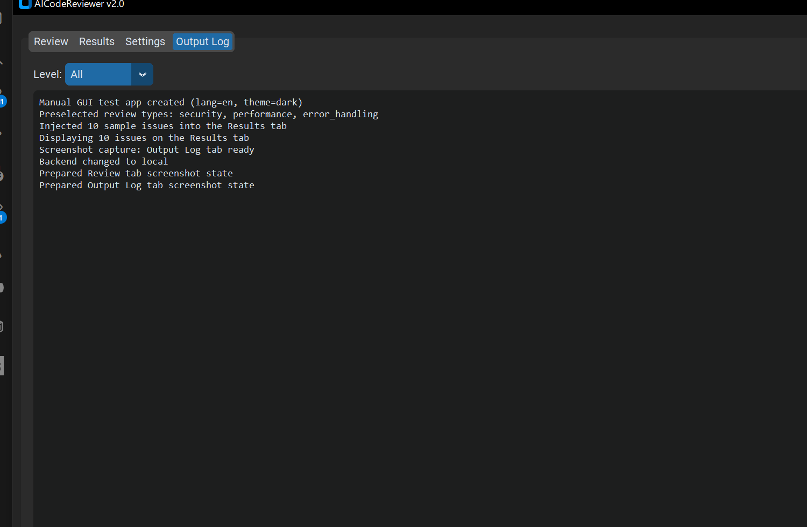
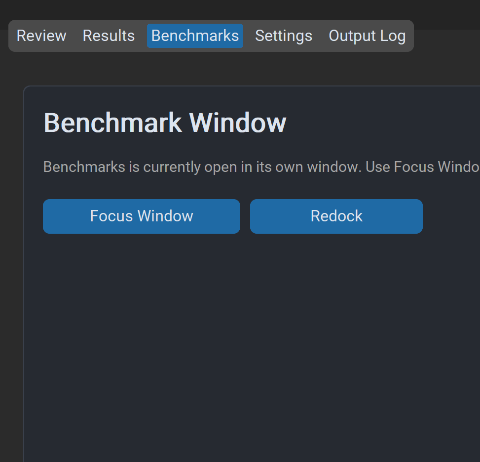
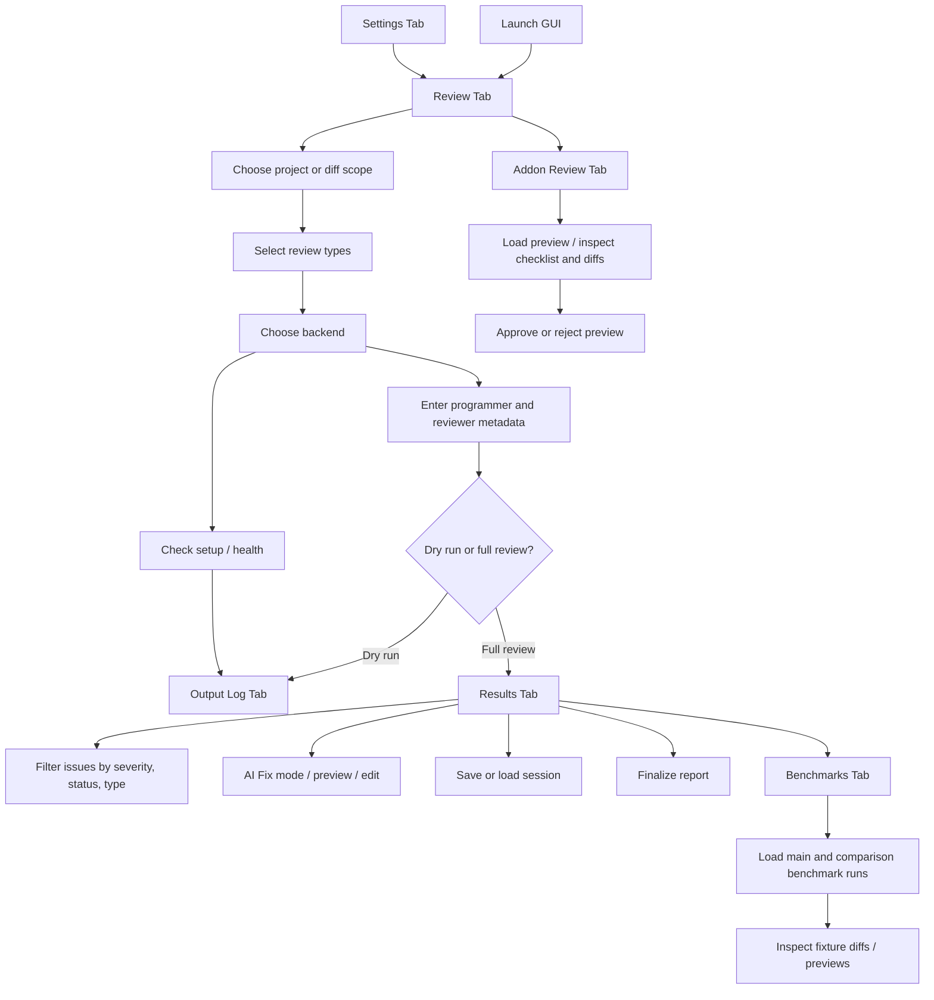
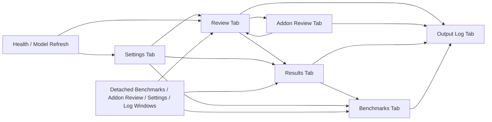

# GUI Guide

The GUI exposes the same core review system as the CLI through a six-surface desktop workflow.

## Launch

```bash
aicodereviewer --gui
```

The screenshots below are generated from the real test-mode GUI with:

```powershell
./tools/capture_gui_screenshots.ps1
```

The checked-in screenshots now cover the main review, results, AI Fix, log, benchmark, and detached-window workflow surfaces. The dedicated Addon Review page is documented below even though it does not yet have a checked-in standalone screenshot. The detached-workflow image shows the shipped placeholder-and-redock state that appears in the main app while the benchmark browser is detached into its own window.

## Screenshots

### Review Tab


### Results Tab


### AI Fix Mode


### Output Log Tab



### Benchmarks Tab


### Addon Review Tab

The Addon Review page is a dedicated desktop surface for loading generated addon previews, inspecting their checklist and diffs, recording reviewer notes, and approving or rejecting the preview without leaving the app.

### Detached Benchmark Workflow



## Tabs

### Review Tab

Use the Review tab to set up a run.

Capabilities:
- sectioned setup flow for target, analysis options, execution context, and run actions
- choose project or diff scope
- pick a project path
- choose all files or selected files
- apply diff-based filtering to a project review
- select one or more review types
- choose backend
- enter programmers and reviewers
- run a full review or dry run
- inspect the built-in review queue summary and targeted submission details when scheduler-backed execution is active
- cancel a queued or active selected submission directly from the queue panel
- keep recent completed or cancelled submissions visible long enough to confirm the last queue outcome

Additional controls:
- progress bar
- cancel button
- elapsed timer
- backend health checks from the status area

Review-type defaults:
- the Review tab can recommend a preset bundle and let you pin the current review-type selection as your default starting point
- a pinned default is explicit and wins on restart until you clear it
- last-used selections are only the most recent ad hoc checkboxes you ran; they are restored only when no pinned default is set

### Results Tab

Use the Results tab to inspect and act on findings.

Capabilities:
- overview cards for total issues, pending triage, high-attention findings, and active backend
- one-click quick triage filters for pending, critical, cross-file, and fix-failed findings
- severity, status, and type filters
- issue cards with scope/status badges, richer metadata, and detail views
- AI Fix mode for single and batch workflows
- preview and edit proposed changes before applying them; preview edits stay staged until you use Apply Selected Fixes
- save and load review sessions with the existing JSON file format preserved on disk
- review changes for resolved items
- finalize reports from the current active or restored session state

### Benchmarks Tab

Use the Benchmarks tab to start a fresh benchmark run, compare saved benchmark runs, and inspect representative scenarios.

Capabilities:
- run the built-in holistic benchmark suite directly from the desktop app and auto-load the generated summary when the run finishes
- browse the built-in benchmark fixture catalog from the configured scenarios folder
- discover saved benchmark summary artifacts under the configured saved-runs folder
- load one summary as the main run and a second summary as the comparison run
- inspect scenario metadata such as review types, fixture tags, and expected focus areas
- scan the fixture-level diff table for shared, primary-only, and comparison-only scenarios
- filter and sort the fixture diff table by presence state or score/status churn
- preview primary and comparison report payloads and inspect a unified diff of the two JSON bodies
- open the active scenario folder, main summary JSON, and generated report directory from the tab
- open the page in a detached window and redock it later without losing the loaded compare state

### Addon Review Tab

Use the Addon Review tab to inspect generated addon previews before approval.

Capabilities:
- load a generated preview directory produced by `analyze-repo`
- review rendered status, metadata, checklist items, and bundle diffs in one place
- add reviewer notes before recording the decision
- approve the preview into the configured addon install location or reject it without activating the addon
- open the page in a detached window and redock it later without losing the loaded preview state

### Settings Tab

Use the Settings tab to manage persistent configuration.

Capabilities:
- backend-specific settings
- performance and processing options
- logging settings
- GUI preferences
- output format selection
- model selection fields where supported
- open the Settings surface in a detached window and redock it later while preserving unsaved form edits

### Output Log Tab

Use the Output Log tab to inspect runtime messages.

Capabilities:
- live log stream
- severity filtering
- clear log
- save log to a text file
- open the log stream in a detached window and redock it later without losing synchronized log history

## Detached Windows

The desktop app supports a detachable-window workflow for selected non-Review pages.

Currently supported detachable pages:
- Benchmarks
- Addon Review
- Settings
- Output Log

Behavior:
- each supported page exposes an `Open In Window` action in the main tab and through the shared status-bar window action
- the shared status-bar action is disabled on Review and Results because those pages stay anchored in the main window
- once a supported page is already detached, the shared status-bar action changes to `Focus Window` for that page until you redock it
- detached windows expose a `Redock` action that returns the page to the main tab
- the Review and Results tabs remain anchored in the main window
- detached window geometry is persisted and restored on restart through the GUI config
- when detached pages are configured to reopen on startup, the app restores those windows and then presents the main window normally instead of staying hidden after launch
- the app keeps one canonical surface active per detachable page, then rebuilds that page in the active host during detach and redock

Windows display note:
- the default Windows GUI setting disables CustomTkinter automatic DPI awareness to avoid stalls and hangs when moving the window across mixed-DPI monitors
- if you prefer sharper per-monitor scaling and your setup is stable, you can opt back in with `gui.automatic_dpi_awareness = true`
- mixed-DPI validation is still best treated as a machine-specific check because the safer default favors startup and cross-monitor stability over aggressive per-monitor scaling behavior

Keyboard shortcuts:
- `Ctrl+Shift+O` opens the currently selected detachable page in its own window
- `Ctrl+W` redocks the active detached page back into the main app

## Typical GUI Workflow

1. Open the Review tab.
2. Choose the review target, scope, and optional diff filtering.
3. Select review types.
4. Choose the backend and enter reviewer metadata.
5. Start the review.
6. Use the Results tab overview cards and quick triage filters to prioritize findings.
7. Inspect issue cards, apply fixes, save sessions, reload sessions, and finalize reports from the current in-memory issue list.
8. Use the Benchmarks tab when you need to compare saved benchmark runs or inspect scenario-level deltas between two review setups.
9. Use the Addon Review tab when you need to inspect a generated addon preview, review its diffs, and approve or reject it.
10. Use the Settings or Output Log tabs if you need configuration changes or runtime detail, and detach supported pages into their own windows when a multi-window layout is more convenient.

## GUI Workflow Diagram



## GUI State Relationships



## Session And Finalize Notes

- Saving a session preserves the same JSON payload shape used by earlier versions of the GUI.
- Loading a session rebuilds typed saved-session state before the Results tab repopulates issue cards.
- Finalize uses the issue list currently visible in the Results tab together with the restored deferred report metadata carried by that session state.
- Loading a session restores finalize-ready state for reporting only; it does not reconnect a live backend client or rerun the review.

## Testing and Manual Validation

The repository includes a manual GUI harness:

```bash
python tools/manual_test_gui.py
```

This is useful for validating:
- results rendering
- benchmark browsing and comparison behavior
- log output
- settings behavior in testing mode
- detached-window open, redock, and restart-restore flows
- AI fix and review-session UI flows

## Related Guides

- [Getting Started](getting-started.md)
- [Configuration Reference](configuration.md)
- [GUI Architecture Plan](handoffs/gui-architecture-plan-2026-04-05.md)
- [GUI UX Audit And Backlog](gui-ux-audit.md)
- [Troubleshooting](troubleshooting.md)