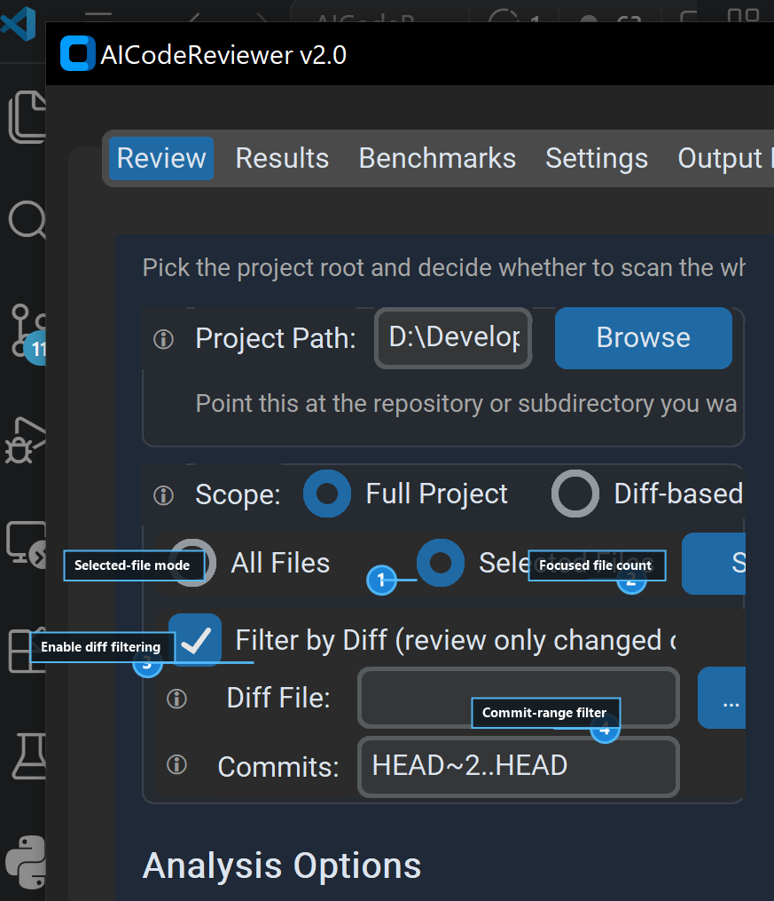
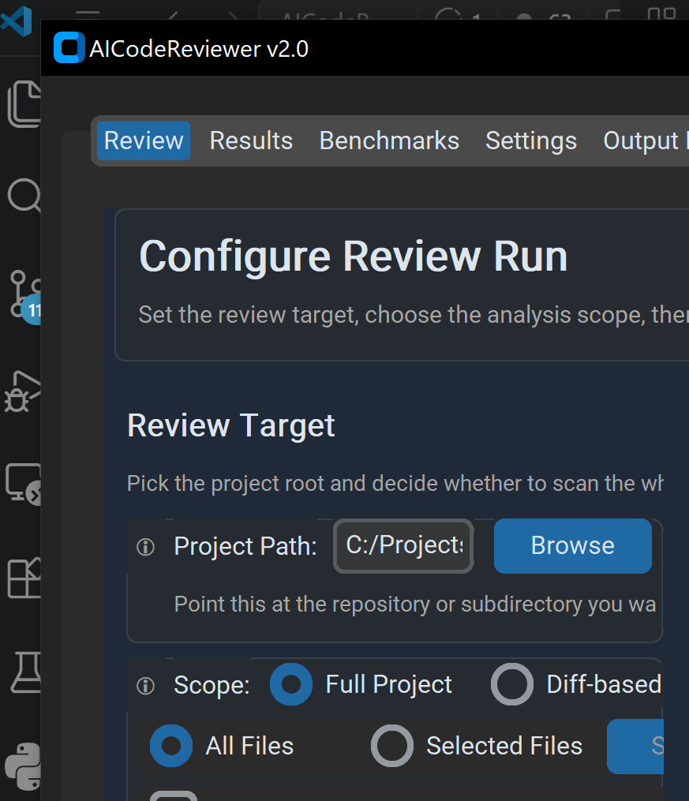
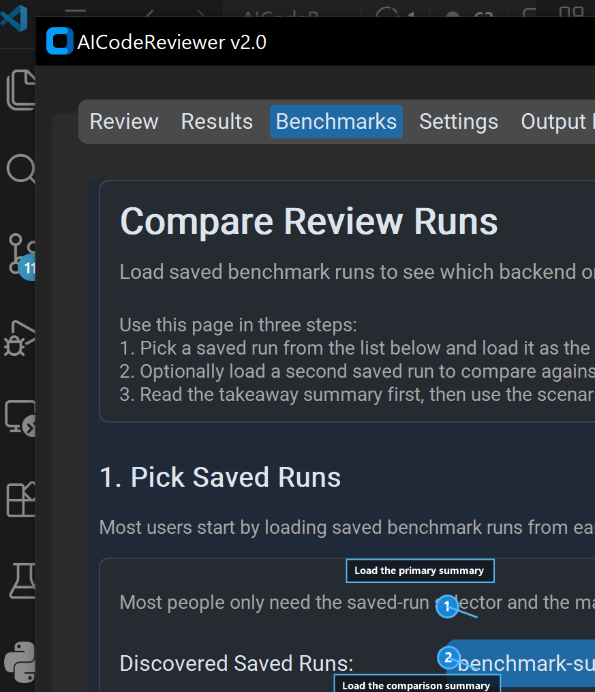
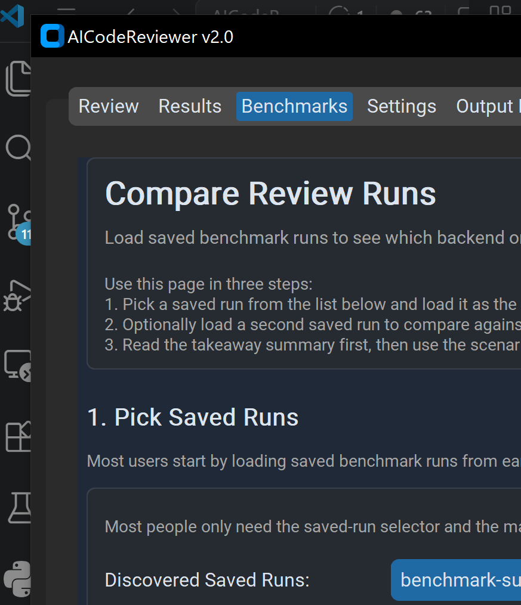

# User Manual

This manual is the task-oriented entry point for using AICodeReviewer.

Use it when you want the shortest path to a working review flow without reading every reference guide first.

## Choose Your Path

Start here based on what you want to do:

- Run your first review from the terminal: go to [CLI First Review](#cli-first-review)
- Review only a diff or change range: go to [Diff Review Workflow](#diff-review-workflow)
- Review only part of a project with selected files or diff filters: go to [Partial Project Workflow](#partial-project-workflow)
- Review code against an external requirements document: go to [Specification Review Workflow](#specification-review-workflow)
- Use the desktop app: go to [GUI First Session](#gui-first-session)
- Generate benchmark summaries for later comparison: go to [Benchmark Runner Workflow](#benchmark-runner-workflow)
- Create or update a benchmark fixture: go to [Benchmark Authoring Workflow](#benchmark-authoring-workflow)
- Generate, inspect, and apply AI fixes in the GUI: go to [AI Fix Workflow](#ai-fix-workflow)
- Save a session, come back later, and finalize reports: go to [Restore A Session And Finalize](#restore-a-session-and-finalize)
- Compare benchmark runs and triage differences: go to [Benchmark Compare Workflow](#benchmark-compare-workflow)
- Automate reviews or AI-fix workflows: go to [Tool Automation](#tool-automation)
- Build a simple addon: go to [Build A Basic Addon](#build-a-basic-addon)
- Drive reviews from another local tool over HTTP: go to [Local HTTP Workflow](#local-http-workflow)
- Recover from setup or runtime problems: go to [Common Recovery Paths](#common-recovery-paths)

## Before You Start

You need:

- Python 3.11 or newer
- one configured backend: Bedrock, Kiro, Copilot, or Local LLM
- a project or diff target you want to review

Install the desktop build:

```bash
git clone <repo-url>
cd AICodeReviewer
pip install -e ".[gui]"
```

Install CLI-only:

```bash
pip install -e .
```

If you have not chosen a backend yet, read [Backend Guide](backends.md) first.

## CLI First Review

Use this path when you want the fastest end-to-end review with minimal setup in the UI.

1. Check that your backend works.

```bash
aicodereviewer --check-connection --backend local
```

2. Run a dry run to confirm target selection without spending backend time.

```bash
aicodereviewer . --type all --dry-run
```

3. Run a focused real review.

```bash
aicodereviewer . --type security --programmers Alice --reviewers Bob --backend local
```

4. If the run is too broad or slow, narrow scope before trying again.

Common next moves:

- use `--scope diff` with `--commits` or `--diff-file`
- choose a smaller review bundle instead of `--type all`
- pass `--backend` explicitly in scripts and repeatable runs

Use [CLI Guide](cli.md) for the full flag and tool-mode reference.

## Diff Review Workflow

Use this path when you want to review only changed files or a specific patch instead of the whole project.

### Review a commit range

1. Start with a dry run so you can confirm the diff target.

```bash
aicodereviewer . --scope diff --commits HEAD~3..HEAD --type security --dry-run
```

2. Run the real review once the selected changes look right.

```bash
aicodereviewer . --scope diff --commits HEAD~3..HEAD --type security,testing --programmers Alice --reviewers Bob --backend local
```

### Review a patch file

```bash
aicodereviewer . --scope diff --diff-file changes.diff --type security --programmers Alice --reviewers Bob --backend local
```

Important rules:

- use either `--commits` or `--diff-file`, not both
- keep the review bundle focused when the diff is small and specific
- use a dry run first if you are unsure whether the diff input covers the files you expect

This is usually the best starting point for pull-request review, pre-merge validation, or targeted regression checking.

## Partial Project Workflow

Use this path when you want to stay in project scope but limit analysis to a curated subset of files or only the files touched by a diff.

This is a desktop-first workflow because the GUI currently exposes selected-file mode and project-scope diff filtering directly.

### Selected files only

Use this when you know exactly which files you want to inspect inside a larger project.

1. Launch the GUI.
2. Keep scope set to project.
3. Switch file selection from all files to selected files.
4. Open the file picker and choose the files you want reviewed.
5. Pick a focused review bundle.
6. Run a dry run first if you want to confirm the narrowed target.

Use this when:

- one subsystem changed but the repository is much larger
- you want a focused architecture, testing, or best-practices pass on a known area
- a full project run would be slower or more expensive than needed

### Project scope plus diff filtering

Use this when you want project-scope context but only for files touched by a patch or commit range.

1. Launch the GUI and keep scope set to project.
2. Turn on diff filtering.
3. Provide either a diff file or a commit range for the filter.
4. Choose your review types and backend.
5. Run a dry run or review.

What this does:

- the run still starts from project scope
- the diff filter narrows the scanned file set to entries that appear in the provided patch or commit range

### Combine selected files and diff filtering

Use this when you want the narrowest project-scope pass.

Example pattern:

1. select only the subsystem files you care about
2. apply a diff filter for the active patch or commit range
3. run a focused review bundle such as `security,testing` or `best_practices`

Important behavior:

- selected-file mode requires you to actually choose at least one file
- project-scope diff filtering requires either a diff file or commit range
- when you combine selected-file mode and diff filtering, the effective review set is the intersection of those two filters rather than two separate reviews
- use ordinary diff scope instead when you want the review to be defined only by the patch itself rather than a project-root context

### Concrete repository example from dry run to final report

Use this pattern when you are changing only the review narrowing logic in this repository and want a very focused pass.



In this capture:

- `1` shows selected-file mode enabled for a narrowed project-scope run
- `2` shows the selected-file count summary
- `3` shows project-scope diff filtering enabled
- `4` shows a commit-range filter that narrows the run to the current change set

Example target files in this repository:

- `src/aicodereviewer/gui/review_mixin.py`
- `src/aicodereviewer/gui/review_execution_facade.py`

Workflow:

1. Launch the GUI and set the project path to this repository root.
2. Keep scope set to project.
3. Switch file selection to selected files and choose only:
	- `src/aicodereviewer/gui/review_mixin.py`
	- `src/aicodereviewer/gui/review_execution_facade.py`
4. Turn on diff filtering.
5. Point the diff filter at the patch file or commit range that contains just your current narrowing change.
6. Choose a focused review bundle such as `best_practices,testing`.
7. Run a dry run first and confirm the narrowed selection looks right.
8. Run the real review once the dry run matches the intended files.
9. Use the Results tab to triage findings, apply AI fixes if needed, and finalize the report when the issue list is ready.

Why this pattern works:

- selected-file mode keeps the run on the exact modules you changed
- diff filtering keeps the review aligned with the current patch or commit range
- the final report still comes from the normal Results workflow, so you keep the same session, AI-fix, and finalize path as a broader review

## Specification Review Workflow

Use this path when you want AICodeReviewer to compare code against an external requirements or design document.

1. Point the run at the project or diff you want to inspect.
2. Pass `specification` as the review type.
3. Provide the requirements document with `--spec-file`.

Example:

```bash
aicodereviewer . --type specification --spec-file requirements.md --programmers Alice --reviewers Bob --backend local
```

You can combine `specification` with other review types, but a focused specification-only run is often easier to validate first.

Common uses:

- checking implementation drift against product requirements
- validating behavior against an interface or migration spec
- reviewing whether a diff preserves an agreed workflow or data contract

Important rules:

- `--spec-file` is required for specification reviews
- use a readable project or diff target so the review has both the code and the spec context
- if you are reviewing a recent change only, combine `--type specification` with `--scope diff`

## GUI First Session

Use this path when you want review setup, triage, AI-fix preview, session save/load, and final report generation in one desktop workflow.

Launch the app:

```bash
aicodereviewer --gui
```

### Review setup



1. Open the Review tab.
2. Choose project or diff scope.
3. Pick review types.
4. Choose a backend.
5. Enter programmer and reviewer names.
6. Run a dry run or start the review.

### Results workflow


After a review completes:

1. Use overview cards and filters to prioritize findings.
2. Open issue details.
3. Use AI Fix mode when you want generated edits.
4. Save a session if you want to return later.
5. Finalize reports from the current active or restored session.

Useful companion workflows:

- detach Benchmarks, Settings, or Output Log into their own windows when you want a multi-window layout
- pin a preferred review-type bundle if you repeat the same startup selection often
- use Benchmarks to compare saved benchmark runs if you are tuning prompts, models, or review bundles

Use [GUI Guide](gui.md) for the full tab-by-tab flow.

## Benchmark Runner Workflow

Use this path when you want to generate saved benchmark summaries before comparing them in the desktop browser.



In this capture:

- `1` shows where to load the primary saved summary
- `2` shows where to load the comparison summary
- `3` shows the fixture-level churn table used for triage
- `4` shows the area where report previews and diffs help explain score or finding changes

1. Choose the backend you want to evaluate.
2. Run a backend connection check unless you already know the environment is healthy.
3. Run the benchmark runner and write results into a dedicated output folder.

Example:

```bash
python tools/run_holistic_benchmarks.py --backend local --lang en --output-dir artifacts/holistic-benchmarks/local-run-2026-04-07 --summary-out artifacts/holistic-benchmarks/local-run-2026-04-07/summary.json --skip-health-check
```

4. Repeat with a different backend, prompt change, or review improvement you want to measure.
5. Open the Benchmarks tab and load the saved summary JSON files as the primary and comparison runs.

Useful variants:

- use `--fixture <id>` when you want to probe one scenario only
- use `--runs <n>` when you want a stability sample rather than one pass
- use `--fixture-timeout-seconds <n>` when one fixture might otherwise stall the full run

Practical advice:

- keep `--lang en` stable when you want comparable saved runs
- store each run in its own output folder so the summary JSON and generated artifacts stay grouped together
- use the generated summary JSON as the thing you load in the Benchmarks tab later

Use [Quality Benchmarks](benchmarks.md) if you need runner flags or fixture-catalog details.

## Benchmark Authoring Workflow

Use this path when you are creating a new holistic fixture or tightening an existing one.

### Build the smallest possible scenario

1. Pick one concrete failure shape, one primary review type, and one minimum passing score.
2. Create a new fixture folder under `benchmarks/holistic_review/fixtures/<fixture-id>/`.
3. Add only the files needed to prove the issue:
	- `project/` for project-scope scenarios
	- `changes.diff` for diff-scope scenarios
	- `spec_file` input only when the scenario is a specification check
4. Keep the sample small enough that a failed expectation is easy to diagnose from the generated report.

### Write the fixture contract first

Start from a minimal `fixture.json` like this:

```json
{
	"id": "api-design-get-create-endpoint",
	"title": "API Design GET Create Endpoint",
	"description": "A FastAPI route uses GET to create invitations and mutate server state.",
	"scope": "project",
	"review_types": ["api_design"],
	"project_dir": "project",
	"minimum_score": 1.0,
	"expected_findings": [
		{
			"id": "get-create-endpoint",
			"file_path_contains_any": ["api.py"],
			"issue_type": "api_design",
			"minimum_severity": "medium"
		}
	]
}
```

Useful expectation fields when you need a tighter contract:

- `file_path_contains_any` when several files can legitimately carry the same issue
- `context_scope` when the scenario must stay cross-file or project-level
- `related_files_contains` when the benchmark should prove multi-file reasoning
- `systemic_impact_contains` or `evidence_basis_contains` when the matcher must anchor on one important phrase instead of broad wording

Prefer the weakest matcher that still protects the real defect shape. Overly specific prose matching creates noisy false failures when the model finds the right issue with different wording.

### Validate the fixture in layers

1. Run the harness tests first.

```bash
pytest tests/test_benchmarking.py tests/test_run_holistic_benchmarks.py -v
```

2. Run only the new or updated fixture.

```bash
python tools/run_holistic_benchmarks.py --backend local --fixture api-design-get-create-endpoint --lang en --output-dir artifacts/holistic-benchmarks/api-design-get-create-endpoint --summary-out artifacts/holistic-benchmarks/api-design-get-create-endpoint/summary.json --skip-health-check
```

3. If the runner writes report files but not the final summary, re-score the output directory directly.

```bash
python tools/evaluate_holistic_benchmarks.py --report-dir artifacts/holistic-benchmarks/api-design-get-create-endpoint
```

4. Open the Benchmarks tab only after the fixture produces a stable saved summary JSON you can compare against earlier runs.

### Tighten the scenario only after reading the miss reason

When a fixture fails, inspect the closest candidate issue and the failed expectation checks before changing the sample project.

Change the fixture content when:

- the scenario still mixes two independent problems
- the relevant code path is hidden behind unrelated noise
- the wrong review type can pass accidentally

Change the expectation contract when:

- the model found the right defect but used a canonical alias
- the evidence text is stable on the real defect but not on one exact phrase
- the issue is valid at project or cross-file scope but the matcher is too local

Use [Quality Benchmarks](benchmarks.md) for the full fixture catalog and scorer details.

## Benchmark Compare Workflow

Use this path when you want to compare two saved benchmark runs and triage the fixtures that changed.



1. Open the Benchmarks tab.
2. Point the tab at the fixture catalog and the folder containing saved benchmark summaries if needed.
3. Load one summary as the primary run.
4. Load a second summary as the comparison run.
5. Inspect the fixture table for shared, primary-only, or comparison-only scenarios.
6. Sort or filter the table to focus on score churn, status churn, or missing fixtures.
7. Open the changed fixture details and compare the primary and comparison report payloads.
8. Use the unified diff when you need to see how finding structure changed between the two runs.

### Compare-run triage pattern

Use this order when a benchmark comparison looks noisy:

1. start with fixtures that changed from pass to fail or fail to pass
2. check whether the changed fixture matches the review type or backend change you intended
3. open the primary and comparison report previews for the affected fixture
4. inspect the unified diff to decide whether the change is a real regression, a useful improvement, or just wording drift
5. if several fixtures moved, focus first on shared structural changes before local phrasing differences

Useful actions from the Benchmarks tab:

- open the active scenario folder
- open the main summary JSON
- open the generated report directory
- detach the benchmark browser into its own window when you want the comparison view visible beside the rest of the app

Use [Quality Benchmarks](benchmarks.md) when you need fixture catalog and runner details.

## AI Fix Workflow

Use this path when you want the desktop app to generate and stage proposed edits for selected findings.


1. Complete a review and move to the Results tab.
2. Filter or inspect issue cards until you find the findings you want to address.
3. Enter AI Fix mode for one issue or a batch of issues.
4. Wait for generated proposals to appear.
5. Review the staged preview carefully.
6. Edit the proposed content if needed.
7. Apply the selected fixes.

Important behavior:

- generated edits are previewed before they are written
- preview edits stay staged until you choose `Apply Selected Fixes`
- fix failures can be surfaced as issue state and should be reviewed before retrying
- the final report can reflect whether a fix was suggested by AI and whether the applied result was edited before write

Use this workflow when you want assistance with straightforward remediations but still need a human check before the file changes land.

## Restore A Session And Finalize

Use this path when you want to pause triage and come back later without rerunning the original review.

### Save and restore

1. Run a review in the GUI.
2. Use the Results tab to save the current session to JSON.
3. Later, load that session back into the Results tab.

What restore gives you:

- the issue list returns without rerunning the backend
- issue-level provenance such as AI suggestion and applied-fix details is restored when it was present
- finalize-ready report metadata is restored with the session so you can continue toward final output

What restore does not do:

- it does not reconnect a live backend client
- it does not rerun the original scan or review

### Finalize reports from a restored session

1. Load the saved session.
2. Continue triage, status edits, or AI-fix review as needed.
3. Finalize the report from the Results workflow when the issue list is ready.

Important behavior:

- finalize uses the issue list currently visible in Results, not an older copy from when the session was first saved
- if a session has no deferred report metadata, finalize is unavailable
- restoring a valid session is enough to rebuild report output without rerunning the review request

Use [Reports and Outputs](reports.md) if you need more detail on report formats or provenance fields.

## Tool Automation

Use tool mode when another script, CI job, or agent needs a stable JSON contract.

Typical sequence:

1. Run a non-interactive review.

```bash
aicodereviewer review . --type security --programmers Alice --reviewers Bob --backend local --json-out artifacts/review.json
```

2. Generate a fix plan.

```bash
aicodereviewer fix-plan --report-file artifacts/review.json --json-out artifacts/fix-plan.json
```

3. Apply selected fixes.

```bash
aicodereviewer apply-fixes --plan-file artifacts/fix-plan.json --json-out artifacts/apply-results.json
```

4. Resume later from any saved artifact.

```bash
aicodereviewer resume --artifact-file artifacts/fix-plan.json
```

Use this path when you want:

- machine-readable review envelopes
- resumable automation
- separated review and apply phases
- retry and diagnostic metadata for failures

Use [CLI Guide](cli.md) and [Reports and Outputs](reports.md) for the full tool-mode contract.

## Build A Basic Addon

Use this path when you want to add a review pack, backend provider, Settings contribution, or popup-editor hooks without editing core files.

Fastest starter path:

1. Copy one of the checked-in examples under `examples/`.
2. Point `addons.paths` at the addon directory or manifest.
3. Run addon discovery.

```ini
[addons]
paths = examples/addon-echo-backend
```

```bash
aicodereviewer --list-addons
```

4. Confirm that the addon appears and that any backend key or Settings contribution is visible.

Use these examples as starting points:

- `examples/addon-secure-defaults/` for manifest-only review-pack contributions
- `examples/addon-echo-backend/` for backend provider plus Settings-surface contribution
- `examples/addon-editor-hooks/` for popup-editor and staged-preview hooks

Use [Addons Guide](addons.md) for the maintained manifest contract and discovery rules.

## Local HTTP Workflow

Use this path when another local tool should submit reviews or read queue state over HTTP.

Start the API explicitly:

```bash
aicodereviewer serve-api --host 127.0.0.1 --port 8765
```

Or enable the embedded loopback API from desktop Settings and restart the GUI.

Typical workflow:

1. Inspect metadata routes such as `/api/backends` and `/api/review-types`.
2. Optionally request a recommended review bundle from `/api/recommendations/review-types`.
3. Submit a review job with `POST /api/jobs`.
4. Observe progress with `/api/events` or `/api/jobs/{job_id}/events`.
5. Fetch reports or artifacts when the job completes.

### Concrete submit, stream, and fetch example

1. Start the API.

```bash
aicodereviewer serve-api --host 127.0.0.1 --port 8765
```

2. Submit a review job that writes a report inside the project root.

```bash
curl -X POST http://127.0.0.1:8765/api/jobs \
	-H "Content-Type: application/json" \
	-d '{
		"path": ".",
		"scope": "project",
		"review_types": ["security"],
		"target_lang": "en",
		"backend_name": "local",
		"dry_run": false,
		"output_file": "review_report.json"
	}'
```

3. Copy the returned `job_id` into a shell variable.

```bash
JOB_ID="<returned job_id>"
```

4. Stream job events while the review runs.

```bash
curl -N "http://127.0.0.1:8765/api/jobs/${JOB_ID}/events?after=0&heartbeat=5"
```

Typical event kinds include state changes and a final result-available event.

5. Fetch the finished report once the job completes.

```bash
curl "http://127.0.0.1:8765/api/jobs/${JOB_ID}/report"
```

6. If you need the generated file payload itself, inspect artifacts and then download the raw artifact.

```bash
curl "http://127.0.0.1:8765/api/jobs/${JOB_ID}/artifacts"
curl "http://127.0.0.1:8765/api/jobs/${JOB_ID}/artifacts/report_primary/raw" --output report.json
```

Important rules:

- `output_file` must stay inside the requested review root or current workspace root
- for a quick event backlog instead of an open stream, use `timeout=0`
- the embedded GUI-started API and CLI-started API expose the same route surface

Use [HTTP API Guide](http-api.md) for route and payload details.

If you are changing the local API implementation rather than just using it, use [Local HTTP Quick Reference](local-http-quick-reference.md).

## Common Recovery Paths

Use these checks before reading deeper troubleshooting material:

1. Confirm the backend you intended is actually selected.
2. Run a backend connection check.
3. Run a dry run to verify scope and file targeting.
4. Turn on debug logging if behavior is still unclear.

Common problem areas:

- Bedrock auth or model-access failures
- Kiro WSL path or CLI invocation problems on Windows
- Copilot CLI auth or large-prompt behavior
- Local LLM URL, API mode, model, or timeout mismatch
- large review scope causing slow or expensive runs

Use [Troubleshooting](troubleshooting.md) for the detailed recovery guide.

## Backend Recovery Guide

Use this section before leaving the manual when the problem is specific to one backend.

### Bedrock recovery

Use this checklist when Bedrock fails with auth, region, or model-access issues.

1. Run a connection check.

```bash
aicodereviewer --check-connection --backend bedrock
```

2. Confirm the AWS auth path you intended is still valid.
3. Confirm the configured region matches the region where the model is enabled.
4. Confirm the configured model is actually available for your account.

Typical symptoms:

- access denied
- model not found or not enabled
- expired SSO or credentials
- region mismatch

If you recently changed shells or profiles, refresh AWS auth first and rerun the check before changing review settings.

Credential refresh example:

```bash
aws configure sso
aws sso login
aicodereviewer --check-connection --backend bedrock
```

Logging example while reproducing a Bedrock problem:

```ini
[logging]
log_level = DEBUG
enable_file_logging = true
log_file = aicodereviewer-bedrock.log
```

After saving the config, rerun the failing check or review and inspect the log file or the GUI Output Log tab.

### Kiro recovery on Windows

Use this checklist when the Kiro backend cannot start from Windows.

1. Verify WSL is installed and working.

```bash
wsl --status
```

2. Confirm the Kiro CLI exists inside the intended distro.

```bash
wsl -- kiro-cli --version
```

3. Re-run the backend connection check.

```bash
aicodereviewer --check-connection --backend kiro
```

Typical symptoms:

- Kiro command not found
- distro mismatch
- Windows-to-WSL path translation failures
- backend timeouts because the CLI never launched correctly

If you use a non-default distro, make sure `kiro.wsl_distro` matches it exactly.

Credential and launch verification example:

```bash
wsl -d Ubuntu -- kiro-cli --version
aicodereviewer --check-connection --backend kiro
```

If your Kiro CLI needs an auth refresh, perform that refresh inside the same WSL distro you configured for `kiro.wsl_distro`, then rerun the connection check from Windows.

Logging example while reproducing a Kiro problem:

```ini
[logging]
log_level = DEBUG
enable_file_logging = true
log_file = aicodereviewer-kiro.log
```

### Copilot CLI recovery

Use this checklist when Copilot is installed but review runs still fail.

1. Confirm the CLI itself is available.

```bash
copilot
```

2. Confirm the account is authenticated and usable from the same shell.
3. Run the backend connection check.

```bash
aicodereviewer --check-connection --backend copilot
```

Typical symptoms:

- command not found
- auth expired or unavailable
- very large review prompts becoming slow or brittle

If the backend is available but large reviews are unstable, narrow the request before retrying:

- use `--scope diff`
- reduce the number of review types in one run
- use selected-file mode in the GUI

Credential refresh verification example:

```bash
copilot
aicodereviewer --check-connection --backend copilot
```

If the Copilot CLI prompts for sign-in or auth refresh, complete that flow first and then rerun the check.

Logging example while reproducing a Copilot problem:

```ini
[logging]
log_level = DEBUG
enable_file_logging = true
log_file = aicodereviewer-copilot.log
```

### Local LLM recovery

Use this checklist when the Local backend cannot connect or cannot discover a usable model.

1. Confirm the model server is running.
2. Confirm the base URL is just the server root and port.
3. Confirm `api_type` matches the server mode.
4. Confirm the model exists or `default` can discover one.
5. Run the backend connection check.

```bash
aicodereviewer --check-connection --backend local
```

Typical symptoms:

- connection refused
- timeout
- unsupported response format
- model discovery failure
- missing keyring-backed credential reference when the server expects an API key

If you suspect a keyring-backed credential issue, open the desktop Settings panel, review the Local LLM key state, and use the explicit rotate or revoke actions before re-saving the value.

Credential refresh example for a keyring-backed Local setup:

1. Open the desktop Settings panel.
2. Go to the Local LLM section.
3. Use `Rotate` if you want to replace the stored secret but keep the reference.
4. Use `Revoke` if you want to clear both the secret and the saved reference.
5. Save the new value and rerun:

```bash
aicodereviewer --check-connection --backend local
```

Logging example while reproducing a Local backend problem:

```ini
[logging]
log_level = DEBUG
enable_file_logging = true
log_file = aicodereviewer-local.log
```

## Worked Recovery Examples

Use these when you want a concrete symptom-to-rerun path instead of a generic checklist.

### Example 1: Copilot CLI auth expired before a rerun

Symptom during a connection check:

```text
❌ Connection failed.
Failure category: auth
Failure stage: connection_test
Detail: GitHub Copilot CLI is not authenticated.
Suggested fix: Run 'copilot' and use /login, or configure GH_TOKEN / GITHUB_TOKEN.
```

Recovery flow:

1. Run `copilot` in the same shell AICodeReviewer will use.
2. Complete `/login` or refresh the token environment variables.
3. Re-run `aicodereviewer --check-connection --backend copilot`.
4. Only then retry the review or benchmark command that was failing.

Expected change after the rerun:

- the connection check changes from `❌ Connection failed.` to `✅ Connection successful!`
- the manual narrowing guidance in this page matters again only if the remaining problem is prompt size rather than auth

### Example 2: Local benchmark run returns `reasoning_content only`

Symptom during a Local benchmark or tool-mode review:

```text
Error: OpenAI-compatible endpoint returned empty assistant content and reasoning_content only. Configure a non-thinking model or disable server-side thinking mode for tool-mode JSON reviews.
```

Recovery flow:

1. Switch the Local backend to a non-thinking model or disable server-side thinking mode on the provider.
2. Run `aicodereviewer --check-connection --backend local` so you do not spend another fixture run on a broken model mode.
3. Re-run the targeted fixture with `--lang en` and its own output directory.
4. If the original runner was interrupted after writing per-fixture reports, re-score the directory with `tools/evaluate_holistic_benchmarks.py` instead of discarding the run.

Expected change after the rerun:

- the runner writes the fixture report JSON and the final `summary.json`
- the Benchmarks tab can load that summary as a normal saved run
- the repeated `reasoning_content only` error disappears from the failing review step

### When runs are just too large

Sometimes the backend is healthy and the workflow is the problem.

Try these in order:

1. switch from full project scope to diff scope
2. use selected-file mode in the GUI
3. add a project-scope diff filter instead of scanning the whole repository
4. run fewer review types in one pass
5. use the Benchmarks tab to compare whether a smaller bundle materially changes results before standardizing it

## Recommended Reading By Goal

- first install and first review: [Getting Started](getting-started.md)
- backend setup: [Backend Guide](backends.md)
- diff and specification review flags: [CLI Guide](cli.md)
- benchmark runner and compare surfaces: [Quality Benchmarks](benchmarks.md)
- desktop workflows: [GUI Guide](gui.md)
- CLI and tool automation: [CLI Guide](cli.md)
- report files and provenance: [Reports and Outputs](reports.md)
- configuration and saved settings: [Configuration Reference](configuration.md)
- addon authoring: [Addons Guide](addons.md)
- local API usage: [HTTP API Guide](http-api.md)

## Notes

- This manual is the workflow entry point, not the complete reference.
- When a command, route, or setting changes, update the linked reference guide and this manual if the user-facing workflow changed.